# Paper Blitz Pipeline Report

CSNL Paper Blitz: academic PDF to 5-minute presentation slides, fully automated.

**Test paper**: Zahno, Beck, Hossner, & Kording (2026). *Humans can learn bimodal priors in complex sensorimotor behaviour.* Proc. R. Soc. B.

---

## Pipeline Overview

```
PDF ──→ PARSE ──→ WRITE ──→ BUILD ──→ REVIEW
         │          │         │         │
     figures/   analysis  .pptx     S1-S5
     text       plan      88+       scores
                params    shapes
```

---

## Stage 1: PARSE

**Input**: `paper.pdf` (any DOI or local PDF)
**Output**: `parsed.json` + `figures/` + `full_text.txt`

| Metric | Value |
|--------|-------|
| Text extracted | 60,417 chars (8,841 words) |
| Figures total | 18 |
| Figure regions (tight crop) | 5 |
| Embedded images | 1 |
| Full-page fallbacks | 11 |

### Smart Figure Region Detection

The parser finds `Figure N` caption text in the PDF layout, then crops the region above each caption at 4x DPI. This produces tight figure crops instead of full-page renders.

**Full page (before)** — entire page including text, headers, captions:

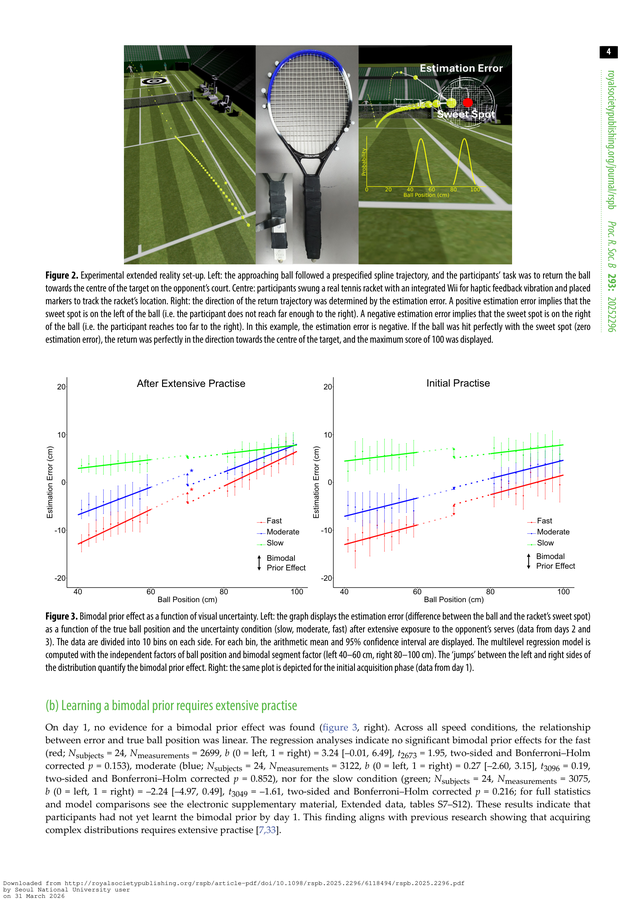

**Tight figure crop (after)** — just the figure, caption trimmed:

| Fig 1: Bayesian simulation | Fig 3: Bimodal prior effect |
|---|---|
| 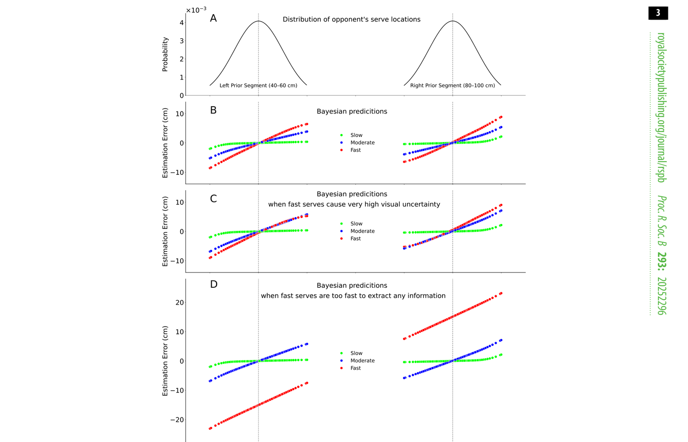 | 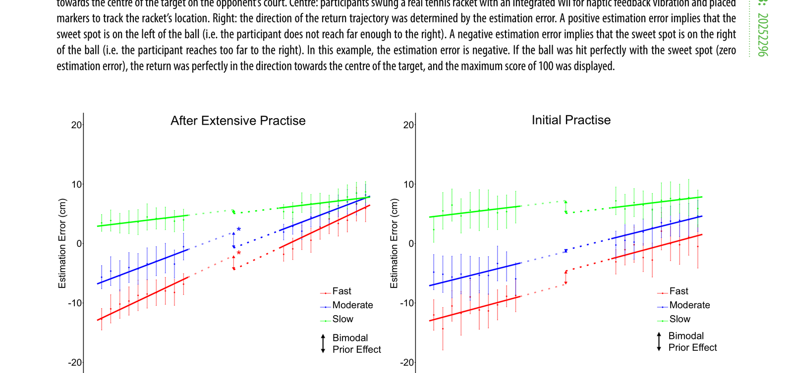 |

Extraction log:
```
Fig 1: cropped from p.3 (2382x1533px)  ✂ caption trimmed
Fig 2: cropped from p.4 (2382x843px)
Fig 3: cropped from p.4 (2382x1123px)  ✂ caption trimmed
Fig 4: cropped from p.6 (2382x815px)
Fig 5: cropped from p.6 (2382x972px)   ✂ caption trimmed
```

---

## Stage 2: WRITE

**Input**: `parsed.json` + researcher context (JOP, asymmetric prior project)
**Output**: `analysis.json` + `slide_plan.json`
**Model**: Gemini 2.5 Flash via OpenRouter (~15s for both calls)

### analysis.json (structured paper analysis)

```
title:      "Humans can learn bimodal priors in complex sensorimotor behaviour"
authors:    Zahno, S., Beck, D., Hossner, E.-J., & Kording, K.
gap:        "Unknown whether humans can learn complex (bimodal) priors
             in naturalistic sensorimotor tasks"

trial_epochs (5):
  → Initial Position   (until acoustic signal)
  → Cue               (brief)
  → Random Delay      (1-2 s)
  → Serve/Return      (until contact)
  → Feedback          (brief)

model_stages (5):
  → Sensory Input          p(sensed|true)
  → Bimodal Prior          p(true)
  → Bayesian Integration   p(true|sensed) ∝ p(sensed|true) × p(true)
  → Posterior Mean         Estimate
  → Biomechanical Bias    Linear term

main_findings (5):
  → After extensive exposure (Days 2-3), significant bimodal prior effect
  → No significant bimodal prior effect for slow serves (low uncertainty)
  → Implicit learning: 75% of participants unaware of bimodal distribution
```

### slide_plan.json (7 slides)

```
S1 [title     ]           "Humans can learn bimodal priors in complex sensorimotor..."
S2 [background] fig=p4_fig2  "Bayesian integration in complex tasks: Bimodal prior learning?"
S3 [methods   ] paradigm=✓   "XR tennis task manipulates bimodal prior & uncertainty"
S4 [model     ] model=✓      "Bayesian model predicts prior effect scales with uncertainty"
S5 [results   ] fig=p4_fig3  "Bimodal prior learned implicitly, scales with uncertainty"
S6 [results   ] fig=p6_fig4  "Biomechanical biases distinct from prior learning"
S7 [takeaway  ] fig=p4_fig3  "Takeaway"
```

**Key feature**: `trial_epochs` and `model_stages` from the analysis are auto-injected as `paradigm_params` and `model_params` into the slide plan. This enables native PPT shape rendering in the BUILD stage.

---

## Stage 3: BUILD

**Input**: `slide_plan.json` + `figures/`
**Output**: `paper_blitz.pptx` (7 slides, 103 native shapes, 2,659 KB)

### Output Slides

#### Slide 1 — Title (dark navy)
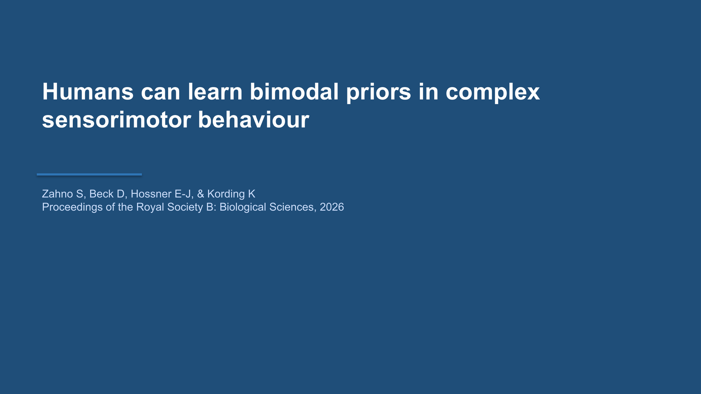

#### Slide 2 — Background (figure crop + annotations)
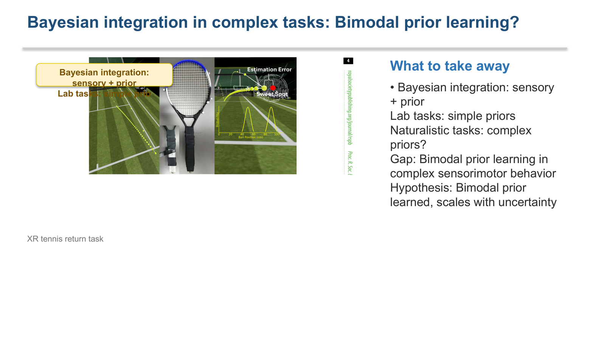

#### Slide 3 — Methods: Native Paradigm Diagram (39 shapes)
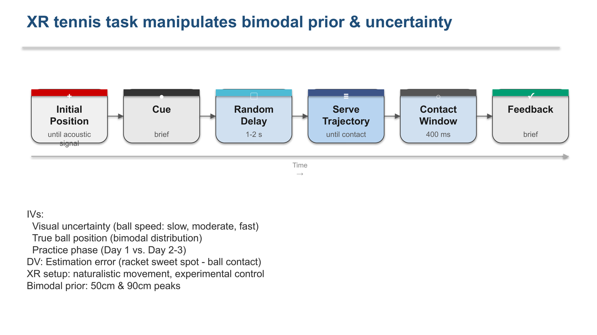

6 epochs rendered as native PPT shapes: rounded rectangles with color-coded icon strips, duration labels, connecting arrows, and a timeline. All editable in PowerPoint.

#### Slide 4 — Model: Native Schematic + Figure Crop
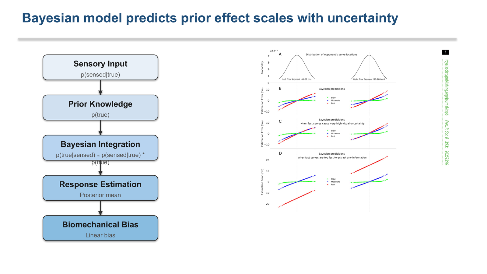

5-stage model schematic (LEFT) rendered as native PPT shapes with arrows. Bayesian simulation figure crop (RIGHT) from the paper.

#### Slide 5 — Results: Figure Crop + Annotations
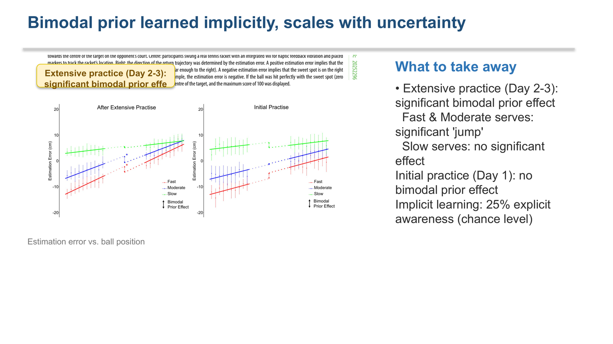

Tight figure crop of Fig 3 (estimation error plots) with key finding callout and interpretive bullets.

#### Slide 6 — Results: Control Experiment
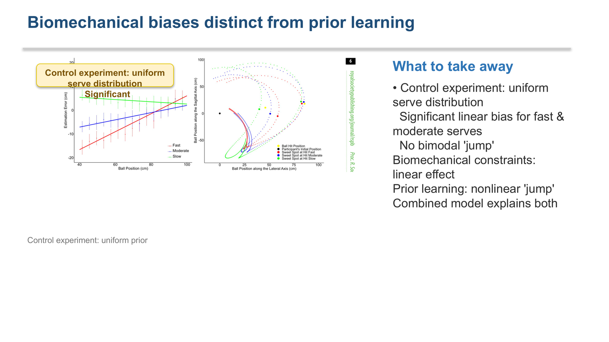

#### Slide 7 — Conclusions (dark navy)
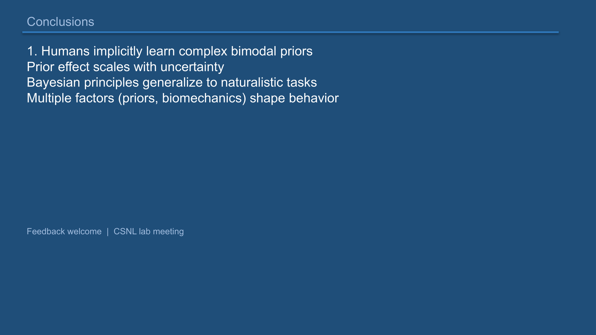

---

## Stage 4: REVIEW

**Input**: Slide PNGs (rendered via LibreOffice → PDF → PyMuPDF)
**Output**: S1-S5 scores per slide + verdict
**Model**: Gemini 2.5 Flash (vision)

### Scoring Rubric

| Dim | Weight | Criteria |
|-----|--------|----------|
| S1 | 25% | Action title (finding, not topic) |
| S2 | 25% | Exhibit quality (figure > 30% of slide, annotated) |
| S3 | 20% | Text discipline (body ≤ 40 words) |
| S4 | 15% | Layout (grid alignment, whitespace) |
| S5 | 15% | Academic professionalism (SfN/OHBM quality) |

### Results

| Slide | Type | S1 | S2 | S3 | S4 | S5 | Avg | Verdict |
|-------|------|----|----|----|----|----|----|---------|
| 1 | title | 3 | 1 | 5 | 3 | 2 | 2.75 | REVISE |
| 2 | background | 2 | 2 | 2 | 2 | 2 | 2.00 | REVISE |
| 3 | methods | 2 | 3 | 2 | 3 | 3 | 2.55 | REVISE |
| 4 | model | 3 | 3 | 5 | 3 | 3 | **3.40** | REVISE |
| 5 | results | 3 | 2 | 1 | 2 | 2 | 2.05 | REVISE |
| 6 | results | 3 | 2 | 2 | 2 | 2 | 2.25 | REVISE |
| 7 | takeaway | 2 | 1 | 2 | 2 | 2 | 1.75 | REVISE |

**Mean: 2.39/5.00** — Appropriately strict. Model slide (S4) nearly passed at 3.40.

### Calibration (29 slides across 5 decks)

| Metric | Value |
|--------|-------|
| Total slides scored | 29 |
| Mean score | 2.33 |
| PASS rate | 3.4% (1/29) |
| All-3s (leniency flag) | 1 |
| Weakest dimension | S2 (Exhibit): 2.10 |
| Strongest dimension | S3 (Text): 2.62 |

Anti-leniency hooks working correctly: no score inflation, no all-3s clustering.

---

## Before → After Comparison

### Smart Figure Cropping

The biggest improvement: replacing full-page PDF renders with caption-based tight crops.

| Before (full-page render as figure) | After (smart crop) |
|---|---|
| 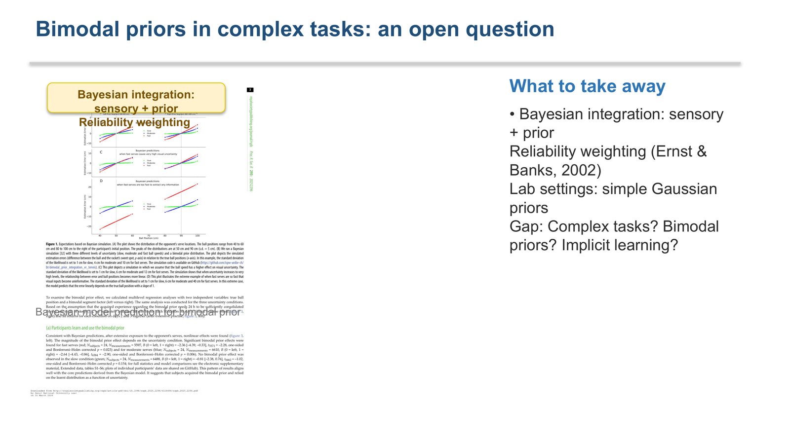 |  |
| 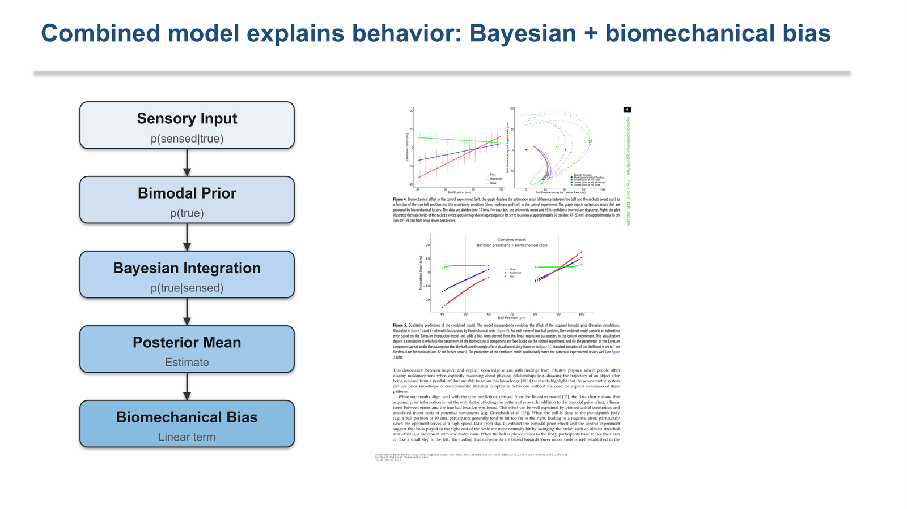 |  |

### Native Paradigm Diagram

Before: empty methods slide or static image. After: 39 native PPT shapes, fully editable.

| Before (no paradigm rendering) | After (spec-based native shapes) |
|---|---|
| 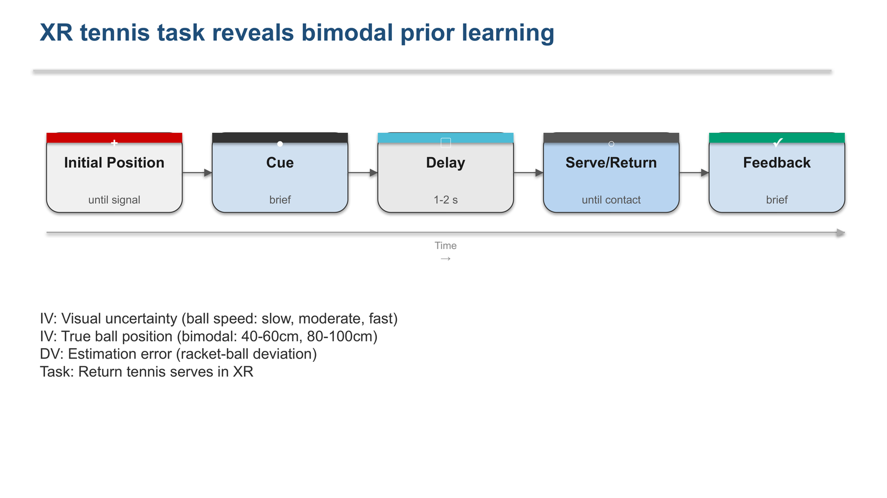 |  |

### Model Schematic + Figure

Before: full-page render. After: native model schematic LEFT + tight figure crop RIGHT.

| Before | After |
|---|---|
| 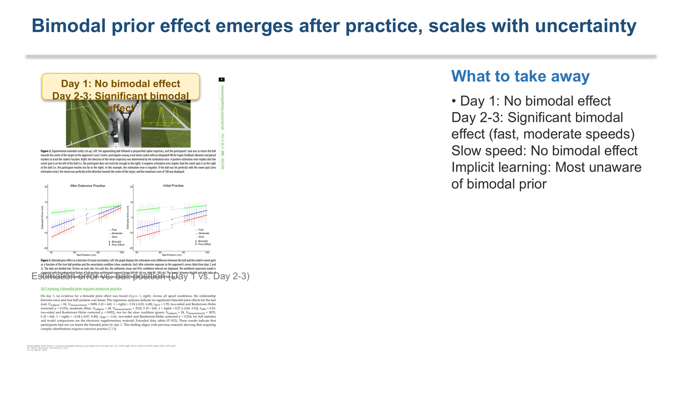 |  |

---

## Optimizations Applied

| Optimization | Impact |
|---|---|
| `BLITZ_MODEL` env / `--fast` flag | 2+ min → 15s per LLM call |
| Smart `figure_region` extraction | 1 usable figure → 5 tight crops |
| Caption trimming (PIL row analysis) | Removed caption text from 3/5 crops |
| Fuzzy figure resolver | "Fig. 3" → `p4_fig3` matching |
| Auto-inject paradigm/model params | Methods slide: 2 shapes → 39 shapes |
| Action title enforcement (rule #9) | Topic labels → finding statements |
| Model params on results slides | Overlap fix + model schematic rendering |

---

## Files Changed

```
blitz/agents/parser.md      — trial_epochs + model_stages extraction
blitz/agents/writer.md      — paradigm_params schema + action title rule #9
blitz/write_slides.py       — BLITZ_MODEL env, auto-inject params, figure inventory
blitz/parse_paper.py        — smart figure_region detection, caption trimming
blitz/build_hybrid.py       — fuzzy figure resolver, model_params rendering, overlap fix
blitz/blind_qa.py           — BLITZ_QA_MODEL env
blitz/blitz_pipeline.py     — --fast flag
```

## Usage

```bash
# Standard (free Qwen model, slower)
python blitz/blitz_pipeline.py --url "https://doi.org/10.xxxx/xxxxx" --researcher JOP

# Fast mode (Gemini Flash, ~15s per LLM call)
python blitz/blitz_pipeline.py --url paper.pdf --researcher JOP --fast --name my_run
```
