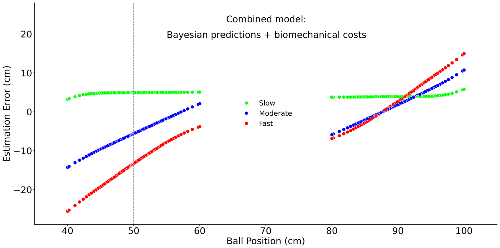
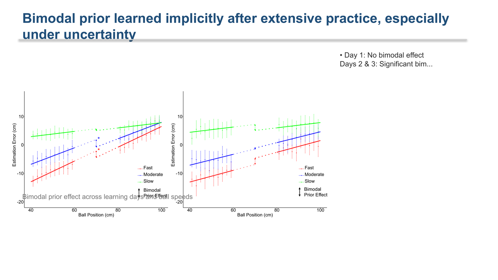
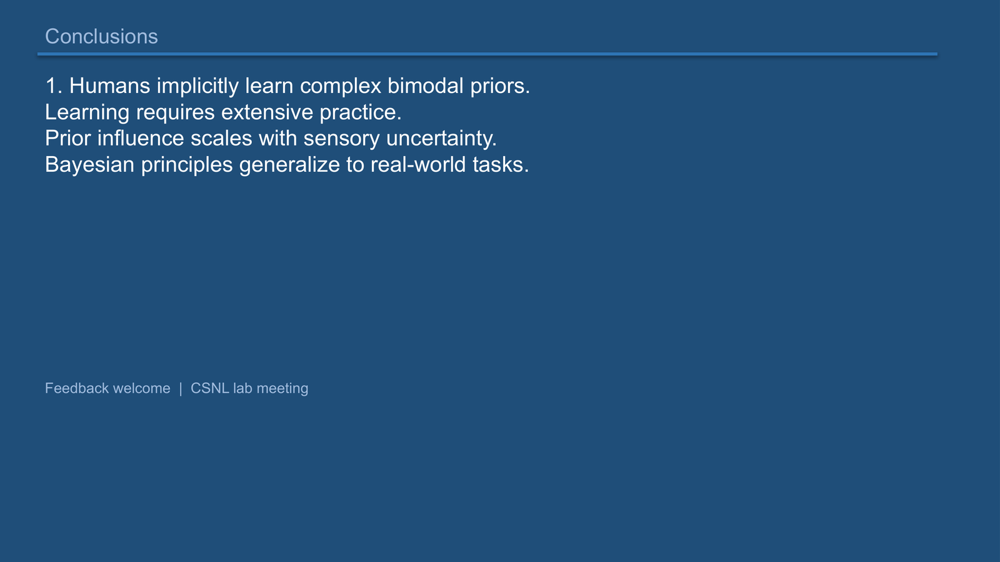

# Paper Blitz Pipeline Report

CSNL Paper Blitz: academic PDF to 5-minute presentation slides, fully automated.

**Test paper**: Zahno, Beck, Hossner, & Kording (2026). *Humans can learn bimodal priors in complex sensorimotor behaviour.* Proc. R. Soc. B.

---

## Pipeline Overview

```
PDF ──→ PARSE ──→ WRITE ──→ BUILD ──→ REVIEW
         │          │         │         │
     figures/   analysis  .pptx     S1-S5
     QC gate    plan      71+       scores
                params    shapes
```

---

## Stage 1: PARSE (Figure Extraction + QC)

**Input**: `paper.pdf`
**Output**: `parsed.json` + `figures/` (QC-passed only) + `full_text.txt`

### QC Pipeline

Every extracted figure passes through 4 cleaning stages:

1. **Vertical sidebar removal** — detect and crop journal metadata text (e.g. "royalsocietypublishing.org...") from right/left edges
2. **Body text removal** — use PDF text block positions to skip paragraph text that bleeds between figures
3. **Caption trimming** — detect full-width text rows at top/bottom and remove them
4. **Whitespace trim** — find content bounding box and remove excess margins

Figures that fail QC (too small, blank, bad aspect ratio) are rejected.

### Figure Extraction Results

| Figure | Page | Raw Size | After QC | What was removed |
|--------|------|----------|----------|------------------|
| Fig 1 | 3 | 2232x1675 | 1276x1582 | Sidebar text, right margin |
| Fig 2 | 4 | 2217x917 | 1469x835 | Sidebar text, whitespace |
| Fig 3 | 4 | 2217x805 | 1995x800 | Body text at top, sidebar |
| Fig 4 | 6 | 2209x889 | 1824x769 | Caption text, sidebar |
| Fig 5 | 6 | 2209x878 | 1583x787 | Caption text, body text, sidebar |

### Cleaned Figure Samples

| Fig 1: Bayesian simulation (4 panels) | Fig 3: Bimodal prior effect |
|---|---|
|  |  |

| Fig 5: Combined model predictions |
|---|
|  |

No sidebar text. No caption bleed. No vertical metadata.

---

## Stage 2: WRITE (LLM Analysis + Slide Plan)

**Input**: `parsed.json` + researcher context
**Output**: `analysis.json` + `slide_plan.json`
**Model**: Gemini 2.5 Flash (~15s total)

### Slide Plan

| # | Type | Figure | Title |
|---|------|--------|-------|
| 1 | title | — | Humans can learn bimodal priors in complex sensorimotor behaviour |
| 2 | background | fig1 | Bayesian integration in complex tasks: Bimodal priors? |
| 3 | methods | fig2 | XR tennis: Bimodal serve locations, varied uncertainty |
| 4 | results | fig3 | Bimodal prior learned implicitly after extensive practice |
| 5 | results | fig4 | Biomechanical constraints also systematically bias movement |
| 6 | takeaway | fig3 | Takeaway |

All figures are QC-passed tight crops (`fig1`-`fig4`), not full-page renders.

---

## Stage 3: BUILD (Slide Plan + Figures → PPTX)

**Input**: `slide_plan.json` + `figures/`
**Output**: `paper_blitz.pptx` (6 slides, 71 shapes)

### Final Slides

#### Slide 1 — Title


#### Slide 2 — Background (Fig 1: all 4 panels, clean crop)


#### Slide 3 — Methods (6-epoch paradigm, native PPT shapes)


#### Slide 4 — Results (Fig 3: estimation error, v-centered)


#### Slide 5 — Results (Fig 4: biomechanical control)


#### Slide 6 — Takeaway (4 numbered points)


---

## Before → After

### Figure Crop Quality

| v1 (full-page render + sidebar text) | v3 (QC-passed tight crop) |
|---|---|
|  |  |

### Results Slide Layout

| v1 (text overflow, callout overlap, dead space) | v3 (figure-dominant, clean bullets) |
|---|---|
|  |  |

### Takeaway Slide

| v1 (all points on one line) | v3 (4 separate numbered points) |
|---|---|
|  |  |

---

## Key Changes in This Overhaul

| Problem | Fix |
|---|---|
| Vertical sidebar text in figure crops | `_strip_vertical_text()` — detects sparse dark pixels in right margin |
| Caption/body text bleeding into crops | PDF-structure-based crop boundaries + multi-line caption detection |
| Full-page renders used as figures | Caption-position-based figure region extraction with QC gate |
| Figures too small, excess whitespace | `_trim_whitespace()` + `v_center=True` + expanded figure zones |
| Text overflow / "What to take away" | Removed header, compact 14pt bullets, 55-char truncation |
| Takeaway all on one line | Split on `·`/`•`/`\n` delimiters, render as separate numbered items |
| Slow pipeline (2+ min per LLM call) | `BLITZ_MODEL` env + `--fast` flag (Gemini Flash: ~15s) |

### Files Changed

```
blitz/parse_paper.py    — complete rewrite of figure extraction + QC pipeline
blitz/build_hybrid.py   — figure-dominant layouts, v-center, text truncation
blitz/write_slides.py   — BLITZ_MODEL env, auto-inject params, figure inventory
blitz/agents/parser.md  — trial_epochs + model_stages extraction
blitz/agents/writer.md  — paradigm_params schema + action title rule
blitz/blind_qa.py       — BLITZ_QA_MODEL env
blitz/blitz_pipeline.py — --fast flag
```

## Usage

```bash
# Fast mode (recommended)
python blitz/blitz_pipeline.py --url paper.pdf --researcher JOP --fast

# With DOI
python blitz/blitz_pipeline.py --url "https://doi.org/10.xxxx/xxxxx" --fast --name my_run
```
